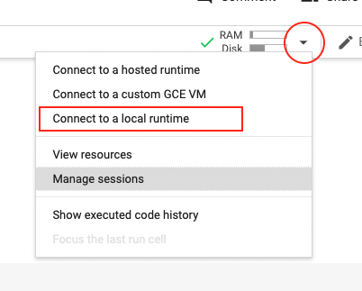
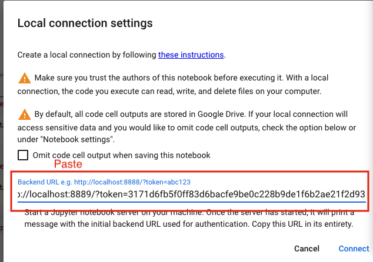
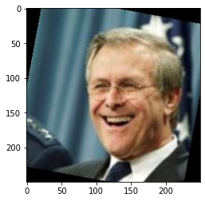
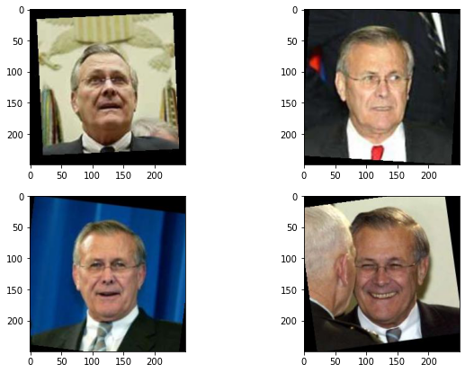

#CS-GY6613 Project -- Team 20

##Team members:

* Danrong Li dl4111@nyu.edu - (AWS contact person)

* Yuxiong (Cody) Cheng yc4909@nyu.edu

* Xuanhua Zhang xz3426@nyu.edu

## Table of Contents

1. [OverView](##OverView)
2. [BaseLine](##BaseLine)
3. [Improvement](#third-example)
4. [Citation](###Citation)

## OverView
In many domains we are interested in finding artifacts that are similar to a query artifact. In this project you are going to implement a system that can find artifacts when the queries are visual. The type of queries you will test your system on are images of faces (30 points) and videos of people. You will also document your approach clearly showing advantages over the baseline.

In the following we use the term person of interest (PoI) to indicate the person that we reverse search on images and videos. The PoI may be present together with others in the datasets but the system should be able to retrieve the images / videos that the PoI. See bonus points for partial occlusion.


## Quick Start
**Clone the project**
 ``` console
 git clone https://github.com/danrongLi/CSGY6613_project.git
 ```
 **Connect Google Colab to your local kernal**


``` console
pip install --upgrade jupyter_http_over_ws>=0.0.7 && jupyter serverextension enable --py jupyter_http_over_ws
jupyter notebook --NotebookApp.allow_origin='https://colab.research.google.com' --port=8889 --NotebookApp.port_retries=0
```

**Copy the URL and paste it in your google colab**




If you want to simulate running locally, please remember to copy and paste the folder "Cody" to your local google colab; delete all pickle (4) and h5 (1) files

Also change all file paths inside jupyter ==(replace r'XX\XX' with your own google drive file path)==

**Packages required** (Please make sure that your local enviroment has all these packages installed)
```python
import os
import random
import time
import math
import tensorflow
import pickle
import numpy as np
from numpy.linalg import norm
from tqdm import tqdm, tqdm_notebook
from tensorflow.keras.preprocessing import image
from tensorflow.keras.preprocessing.image import ImageDataGenerator
from tensorflow.keras.applications.resnet50 import ResNet50, preprocess_input
from tensorflow.keras.applications.vgg16 import VGG16
from tensorflow.keras.applications.vgg19 import VGG19
from tensorflow.keras.applications.mobilenet import MobileNet
from tensorflow.keras.applications.inception_v3 import InceptionV3
from tensorflow.keras.models import Model
from tensorflow.keras.layers import Input, Flatten, Dense, Dropout, GlobalAveragePooling2D
from sklearn.neighbors import KNeighborsClassifier
from sklearn.model_selection import train_test_split
import tarfile
import matplotlib.image as mpimg
import matplotlib.pyplot as plt
```
## BaseLine

### Features extraction
In our baseline project we choose =='vgg19'== as our features extracting model.
```python
model_architecture = 'vgg19'
model = model_picker(model_architecture)

batch_size = 128
datagen = tensorflow.keras.preprocessing.image.ImageDataGenerator(preprocessing_function=preprocess_input)

generator = datagen.flow_from_directory(root_dir,target_size=(250,250),class_mode=None, shuffle=False)
num_images = len(generator.filenames)
num_epochs = int(math.ceil(num_images / batch_size))

start_time = time.time()
feature_list = []
#feature_list = model.predict_generator(generator, num_epochs)
feature_list = model.predict(generator, num_epochs)
end_time = time.time()

print("Num images   = ", len(generator.classes))
print("Shape of feature_list = ", feature_list.shape)
print("Time taken in sec = ", end_time - start_time)
```
Num images   =  13233
Shape of feature_list =  (13233, 512)
Time taken in sec =  1818.6331593990326

**Save these features to a pickle file**
```python
pickle.dump(generator.classes, open(r'C:\Users\djain\Documents\2022_Spring\6613 AI\project\lfw\class_ids-lfw.pickle', 'wb'))
pickle.dump(filenames,open(r'C:\Users\djain\Documents\2022_Spring\6613 AI\project\lfw\filenames-lfw.pickle', 'wb'))
pickle.dump(feature_list,open(r'C:\Users\djain\Documents\2022_Spring\6613 AI\project\lfw\features-lfw-' + model_architecture + '.pickle', 'wb'))
```
### Similarity Search
The goal of this project is that when the user inputs an image, we can find similar images in our dataset and return them to the user.

**KNN**

```python
knn = KNeighborsClassifier(n_neighbors=20)
knn.fit(X_train, y_train)
y_pred = knn.predict(X_test)
```
**Randomly select an Image for testing**
```python
user_input_img = mpimg.imread(list_file[user_input_index])
plt.imshow(user_input_img)
```


**Search Result**
```python
print("Here are some similar faces that you might be interested:")
list_faces = get_file_list('drive/My Drive/nyu second semester/artificial intelligence/ai_project/Cody/LFW/deepfunneled'+'/lfw-deepfunneled/'+name_output)
num_faces = len(list_faces)
fig = plt.figure(figsize=(10, 7))
rows = 2
columns = 2
for i in range(min(4,num_faces)):
  fig.add_subplot(rows, columns, i+1)
  output_img = mpimg.imread(list_faces[i])
  plt.imshow(output_img)
```



### Citation
- Practical Deep Learning for Cloud, Mobile, and Edge 
https://www.oreilly.com/library/view/practical-deep-learning/9781492034858/
